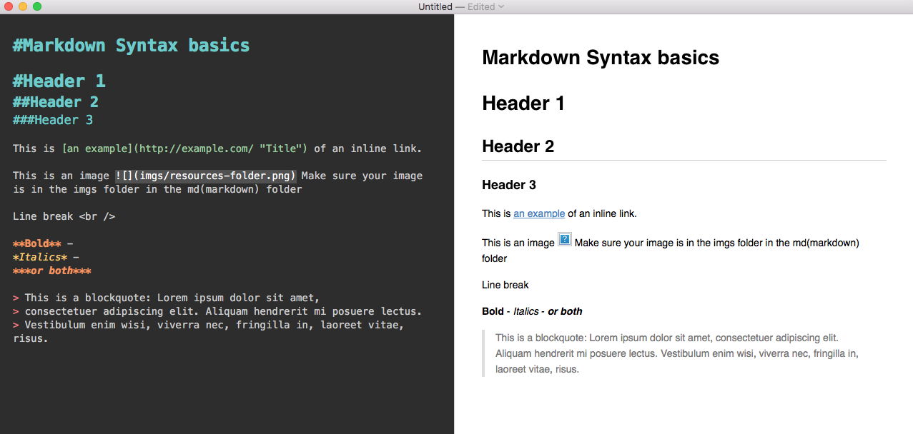

---
Pr-id: Institute of Network Cultures
P-id: TOD Manual
A-id: 10
Type: article
Book-type: anthology
Anthology item: article
Item-id: unique no.
Article-title: title of the article
Article-status: accepted
Author: name(s) of author(s)
Author-email:   corresponding address
Author-bio:  about the author
Abstract:   short description of the article (100 words)
Keywords:   epub, pandoc, conversion, hybrid, workflow, publishing, arts publishing, styles, css, markdown, design, ebooks, epub3, GitHub
Rights: CC BY-NC 4.0
...

# Manual: How to produce a Theory on Demand

##Contents
 
Introduction 

1\. Prepare your desktop
	
2\. Prepare repository 

3\. Prepare Manuscript 
> According to INC style guide
> 

4\. Make Epub
> make markdowns
> syntacs 

5\. Make PDF
> Make ICMLS
> Indesign
> Export

6\. Publisch TOD
> LULU, Issue etc 
> INC site

#Introduction

This manual shows you, step by step, how to create a theory on demand. 

For more information about the workflow and creating output for print files, visit the PublishingLab [site](http://www.publishinglab.nl/resources/hybrid-publishing-workflow-faq)

The Hybrid Publishing Toolkit method builds on chapter 6 of the Hybrid Publishing Toolkit book, it relies on a makefile and using the command line.

#1. Prepare your desktop 

### Step 1.1 install all requirements

Before you begin you will need:

- text processor (Microsoft Office or Openoffice);
- <a href="https://desktop.github.com/">GitHub Desktop</a> (for working collaboratively);
- markdown editor like <a href="http://macdown.uranusjr.com/">MacDown</a> or XCode (to edit your sourcefiles);
- Plain-text editor (like <a href="http://www.sublimetext.com/">Sublime Text</a> or <a href="https://wiki.gnome.org/Apps/Gedit">Gedit</a>);
- Install <a href="http://www.adobe.com/nl/creativecloud.html">Adobe Indesign</a>; 
- <a href="http://calibre-ebook.com/download">Calibre</a> (to view/edit ebooks);
- <a href="http://pandoc.org/installing.html">Pandoc</a> (you can install Pandoc with <a href="https://brew.sh/">Homebrew</a>);
- git (for Mac git is included in Xcode, for Windows see <a href="https://git-scm.com/download/win">https://git-scm.com/download/win</a>;
- you will need to familiarise yourself with the command line (terminal
on Mac or go to the Start menu on Windows and type cmd into search/run - more <a
href="http://www.computerhope.com/issues/chusedos.htm">here</a>).

#2. Prepare repository 
### Step 2.1 Get your git on

Go to [https://github.com/](https://github.com/) and login 

	User: dptoolkit@gmail.com
	Pass: amsterdam010
	
- Create new repository TOD#;
- Clone the repository to your Github desktop (click set up in desktop);
- Copy folders from this repository (manual) to your own theory on demand repository.

### Prepare folder // commit to master

- Copy folders from this repository (manual) to your own theory on demand repository.
- Make sure you copy all folders and make files.

**MAKE SURE YOU UPLOAD ALL CHANGES TO THE REPOSITORY ON GITHUB.ORG BY CLICKING 'COMMIT TO MASTER' IN THE GITHUB DESKTOP**

Folder must contain:

Folder structure 

Go to gitdesktop
type changes in summary (prepare folder) - commit to master // if needed publish folder. 

#3 Prepare manuscript 

#4 Make Epub 

###Step 3.1  Styling the manuscript inside Word: introducing structural meaning to the text

    Download one file from the Gray Zones manuscripts: http://publicationstation.wdka.hro.nl/andre/Gray_Zones/
    save it on a specific folder dedicated this workshop
    open it in your text processors and style it according to INC's style-guide
    save it in .docx

Converting the .docx to a Markdown plain-text file by opening your computer's Terminal navigate to that specific folder by typing: 
	
	cd (with a space at end) and dragging and dropping to the terminal the 
	specific folder, and pressing enter. 
	with Pandoc to convert a .docx to a markdown plain text file

pandoc --from=docx --to=markdown --atx-headers --output=mymarkdownfile.md mydocfile.docx

    --atx-headers option: results in use nice Markdown headers: ##

Markdown will be the working document. The working format. It will be here that the changes and corrections will occur. The .docx is what INC receive's usually from the author and needs to

## How: Instructions for Creating an ePub

Andre Castro prepared an excellent workshop, based on an updated version
of the Hybrid Publishing Toolkit Workflow <a
href="https://github.com/DigitalPublishingToolkit/workshop-going-hybrid/wiki">here</a>.

Below are some simplified steps:

Step 1
Once you've installed the programs listed above, visit the PublishingLab <a href="https://github.com/DigitalPublishingToolkit/Hybrid-Publishing-Resources">Resources</a> page on GitHub.

Step 2
Clone or save this resource repository to your computer
It will include several folders as well as the makefile.

Step 3
Rename this folder to your book title

Step 4
Make sure your manuscript(s) are saved as .docx files and move them to the docx folder, replacing the Test-chapter.docx file.

Step 5
Open command line (terminal on Mac)

Step 6
Use the command line to navigate to the Resources folder (that you renamed). You will need some knowledge of using the command line, you can find help with this <a
href="http://en.flossmanuals.net/command-line/getting-started/">here</a>.

Step 7
Check you have pandoc installed correctly
do this by typing 'pandoc --version' in command line

Step 8
Create the source file(s) for your ebook by typing 'make markdowns' in command line

Step 9
Now that you have markdown files, you can create an epub! type 'make epub' in command line

Step 10
Check the resources folder to see your book.epub file, which you can open with Calibre or iBooks.

If you get an error message, there is a useful resource section <a href="http://www.publishinglab.nl/resources/hybrid-publishing-workflow-faq/">here</a> to help you.

###Syntax

For more examples see [http://daringfireball.net/projects/markdown/syntax](http://daringfireball.net/projects/markdown/syntax)

### Avoiding Errors

make sure there are no spaces or unusual characters (like %) in file names

make sure you work with .docx files not .doc

put any images (.jpg or .png) in the 'imgs' folder inside the markdown folder except the cover*

*the cover.jpg image belongs in the epub folder

### Three key things an ePub developer needs to have right

A successful ePub has been visually styled (with css and a cover), correctly classified (with metadata), and validated.

The epub folder typically has 3 important components:

* the cover image (png or jpg)
* stylesheet
* metadata file

The final book needs to have the correct cover image obviously, but you also need to be sure the metadata file has the right information in it so that people can find your book. Talk to the editor to be sure you have the right metadata information, including the epub isbn number.
Here's more information about <a href="http://www.publishinglab.nl/blog/2015/09/25/metadata-schmetadata-whats-it-good-for/">metadata</a>.

The look of your book is controlled by the styles, you can get color values and typeface suggestions from the print designer. Make sure you embed the fonts you use by including them in the make file and in the lib folder.
Here's more information about <a href="http://www.publishinglab.nl/blog/2015/07/01/epub-typography/">type in epubs</a>.

Last, but not least, the developer needs to validate epub to make sure there are no errors that will cause it to be rejected from a retailer or not open correctly for readers.

### Validating your ePub file

Make sure you validate the ePub file before you send it out into the
world. If it isn't valid Google Play Books and other ePub readers may
not be able to open your new book, causing reader frustration!

You can use the <a href="http://validator.idpf.org/">online
validator</a> for smaller ePubs (under 10MB)

The validator will show you where the errors are in your book. See the example below:

The error occurs in chapter ch002.xhtml, line 47, there's an explanation that a 'referenced resource is missing', but it helps a lot to edit the book in <a href="http://calibre-ebook.com/download">Calibre</a> and further diagnose that in this case an image is missing.

Then find the missing image(s) and then fix them in the source (markdown) file. It is important that you make the corrections in the markdown file because then you just do the work once and the changes are made to the epub as well as html or icml files for the print designer.

or install the validator on your Desktop from <a
href="https://github.com/idpf/epubcheck">GitHub</a>.

The idpf includes a useful wiki to help you understand
<a
href="https://github.com/IDPF/epubcheck/wiki/Errors">errors</a>.

when validating your ePub on your desktop, navigate to the folder with
the .jar file and copy this in your commandline:

    java -jar epubcheck.jar file.epub

(Make sure to replace the generic file.epub with the location + name of
your own epub.)

### Example

The workflow below is a compilation of efforts from the Hybrid Publishing Toolkit, Andre Castro, Michael Murtaugh and others from the
DPT collective.

example: <a
href="http://networkcultures.org/blog/publication/from-print-to-ebooks-a-hybrid-publishing-toolkit-for-the-arts/">From
Print to eBooks: A Hybrid Publishing Toolkit for the Arts</a>

### Sources / list of inspiration

<a
href="http://networkcultures.org/digitalpublishing/2014/10/21/hybrid-workflow-how-to-making-automated-workflows-part-2/">Hybrid
Workflow</a> is a workflow developed to help art publishers create
digital versions of their publications, focused on an ePub3 output.

<a href="http://hpt.publishinglab.org/index.php?about">The Sausage
Machine platform</a> is based on Pandoc and designed to complement
and simplify the Hybrid Publishing workflow by ouputting the desired
formats and setting up a repository for you.

<a
href="http://en.flossmanuals.net/command-line/getting-started/"> A
good resource </a> for getting started with command line.

###Indesign output

###Cover

**COMMIT TO MASTER**

#6. Publish the book 
How to publisch the theory on demand online

###Step 6.1 Issuu 
- On Issuu the publication should be set with the cover and single pages in one single PDF
- After the cover follows a white page
- In the case the cover is in a different file use Adobe Acrobat to merge the PDF: [http://www.dummies.com/howto/
content/insertinganddeletingpagesinpdfdocumentswith.
html](http://www.dummies.com/howto/
content/insertinganddeletingpagesinpdfdocumentswith.
html)

Go to [http://issuu.com/login?](http://issuu.com/login?) and login as INC:  

	user: info@networkcultures.org
	pass: videovortex

Click on upload: Upload your PDF and fill out the form:   

 - replace the automatically added title;
 - add description (take this from the back cover text); 
 - add date; 
 - click Allow download and leave the visibility on Public.
 - and then Publish!

Now you should be able to see your publication in [http://issuu.com/home/publications](http://issuu.com/home/publications)

###Step 6.2 LULU 

In this case we will need two PDFs: 

- For the inside, we need a single PDF with single pages, without cover. 
- Spreadsheet for the cover (with spine)

Go to [http://www.lulu.com/](http://www.lulu.com/)

		user: margreet@networkcultures.org
		pass: INC05a20

- Click on Creëren / Create and choose Print book On
the next page choose **Premium pocketboek**, then scroll down and choose **Royal** as the format and end
by clicking **‘Dit boek maken’** in the orange arrow:

- Fill in your Title and Author(s) and leave the first options (Lulu, Amazon, Barnes and Nobles) selected 
- Add the ISBN to the publication, **don’t add the barcode**
- Click on Choose File and select your inside PDF, then click on **Upload**
- Click on **“Make PrintReady File”**
- Click on **“advanced onepiece cover designer”**. You will be prompted with all the necessary specs to create the PDF cover. It will be a single sheet having the front cover on the right and the back cover on the left. You can design it using Adobe Illustrator.
- Choose your file and upload it, click **“Save and Continue”**
- Fill the form with the requested info Click **“Save and Continue”**
- Set the price as the minimum suggested by the platform and click on review project
- Finally review your project and then click on **“Save and Finish”**. If you click on the blue title you should see your book for sale on Lulu

###Step 6.3 Upload in INC page
Embed the book on [http://networkcultures.org/](http://networkcultures.org/) In this last part we will create the page for the publication on the INC blog.

Login to [http://networkcultures.org/](http://networkcultures.org/)


- Go over Publications and click on **Add New**; fill the form with title of the book
- Go to the Issuu page relative to the publication and click the **embed button**
- Click on styling option and change the **width to 600**
- Check **“Use on Tumblr, Wordpress or similar”**, click on Save style and then copy the **Embed** code
- Paste the embed code at the top of the content box according to the series, check the correct category 
- Add a (small) image of the cover
- Add colophon info to the Info box
- Don’t add a link in the download area. 
- Click on Publish You should finally see you publication in [http://networkcultures.org/publications/](http://networkcultures.org/publications/)


